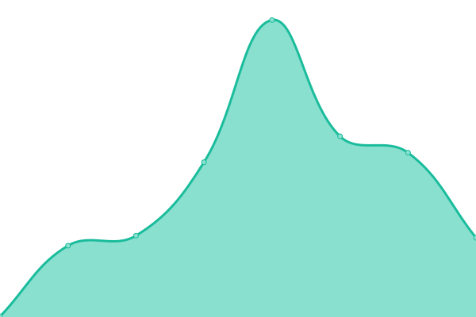

# [📈 Live Status](https://demo.upptime.js.org): <!--live status--> **🟧 Partial outage**

This repository contains the open-source uptime monitor and status page for [Upptime](https://upptime.js.org), powered by [Upptime](https://github.com/upptime/upptime).

With [Upptime](https://upptime.js.org), you can get your own unlimited and free uptime monitor and status page, powered entirely by a GitHub repository. We use [Issues](https://github.com/upptime/upptime/issues) as incident reports, [Actions](https://github.com/upptime/upptime/actions) as uptime monitors, and [Pages](https://demo.upptime.js.org) for the status page.

<!--start: status pages-->
<!-- This summary is generated by Upptime (https://github.com/upptime/upptime) -->
<!-- Do not edit this manually, your changes will be overwritten -->
<!-- prettier-ignore -->
| URL | Status | History | Response Time | Uptime |
| --- | ------ | ------- | ------------- | ------ |
|  [My status monitor(https://status.iamon99.com)](https://status.iamon99.com) | 🟩 Up | [my-status-monitor-https-status-iamon99-com.yml](https://github.com/louiscklaw/upptime-playlist/commits/HEAD/history/my-status-monitor-https-status-iamon99-com.yml) | 

 730ms
     
 | 

<a href="https://upptime.github.io/upptime/history/my-status-monitor-https-status-iamon99-com">100.00%</a>
    

|  [Test portfolio site (portfolio.iamon99.com)](https://portfolio.iamon99.com) | 🟥 Down | [test-portfolio-site-portfolio-iamon99-com.yml](https://github.com/louiscklaw/upptime-playlist/commits/HEAD/history/test-portfolio-site-portfolio-iamon99-com.yml) | 

 0ms
     
 | 

<a href="https://upptime.github.io/upptime/history/test-portfolio-site-portfolio-iamon99-com">100.00%</a>
    

|  [Test dashboard site (https://dashboard-76c7d.web.app)](https://dashboard-76c7d.web.app) | 🟥 Down | [test-dashboard-site-https-dashboard-76c7d-web-app.yml](https://github.com/louiscklaw/upptime-playlist/commits/HEAD/history/test-dashboard-site-https-dashboard-76c7d-web-app.yml) | 

 80ms
     
 | 

<a href="https://upptime.github.io/upptime/history/test-dashboard-site-https-dashboard-76c7d-web-app">100.00%</a>
    

|  [Test dashboard site (https://lynked.co.jp)](https://lynked.co.jp) | 🟩 Up | [test-dashboard-site-https-lynked-co-jp.yml](https://github.com/louiscklaw/upptime-playlist/commits/HEAD/history/test-dashboard-site-https-lynked-co-jp.yml) | 

 2316ms
     
 | 

<a href="https://upptime.github.io/upptime/history/test-dashboard-site-https-lynked-co-jp">100.00%</a>
    

|  [Google](https://www.google.com) | 🟩 Up | [google.yml](https://github.com/louiscklaw/upptime-playlist/commits/HEAD/history/google.yml) | 

 74ms
     
 | 

<a href="https://upptime.github.io/upptime/history/google">100.00%</a>
    

|  [healthcheck](http://healthcheck.iamon99.com/ping/e7066192-2650-40e2-a626-be18fb7ee4dd) | 🟥 Down | [healthcheck.yml](https://github.com/louiscklaw/upptime-playlist/commits/HEAD/history/healthcheck.yml) | 

 491ms
     
 | 

<a href="https://upptime.github.io/upptime/history/healthcheck">100.00%</a>
    

|  [Hacker News](https://news.ycombinator.com) | 🟩 Up | [hacker-news.yml](https://github.com/louiscklaw/upptime-playlist/commits/HEAD/history/hacker-news.yml) | 

 2955ms
     
 | 

<a href="https://upptime.github.io/upptime/history/hacker-news">100.00%</a>
    

|  [Test Broken Site](https://thissitedoesnotexist.koj.co) | 🟥 Down | [test-broken-site.yml](https://github.com/louiscklaw/upptime-playlist/commits/HEAD/history/test-broken-site.yml) | 

 0ms
     
 | 

<a href="https://upptime.github.io/upptime/history/test-broken-site">100.00%</a>
    

<!--end: status pages-->

[**Visit our status website →**](https://demo.upptime.js.org)

## 📄 License

- Powered by: [Upptime](https://github.com/upptime/upptime)
- Code: [MIT](./LICENSE) © [Upptime](https://upptime.js.org)
- Data in the `./history` directory: [Open Database License](https://opendatacommons.org/licenses/odbl/1-0/)
